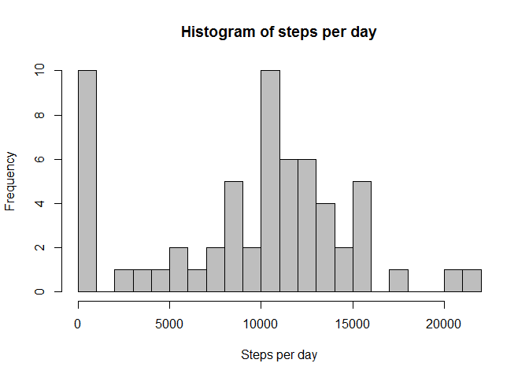
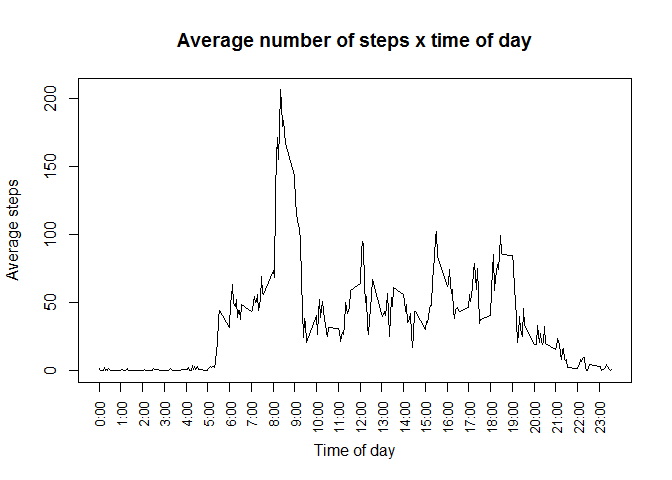
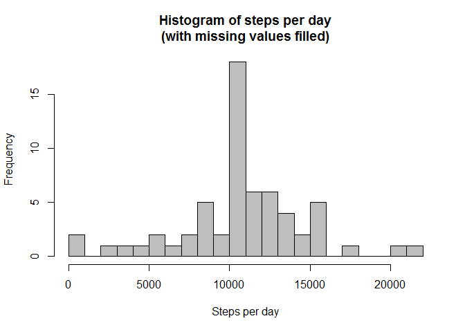
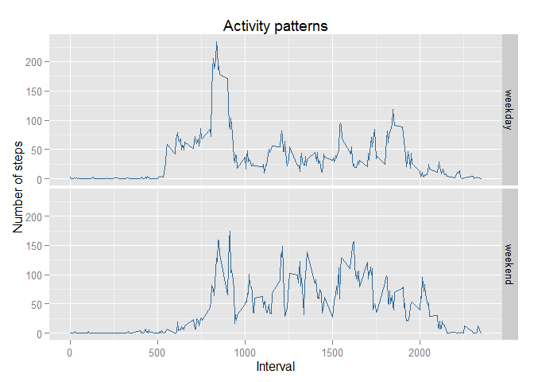

# Reproducible Research: Peer Assessment 1


## Loading and preprocessing the data


```r
# Load required libraries
library(dplyr)
```

```
## 
## Attaching package: 'dplyr'
## 
## The following objects are masked from 'package:stats':
## 
##     filter, lag
## 
## The following objects are masked from 'package:base':
## 
##     intersect, setdiff, setequal, union
```

```r
library(ggplot2)

# load data file
activity <- read.csv("activity.csv", sep=",")
```

## What is mean total number of steps taken per day?

For this plot we will use the original data (without NA's removed), so we can also see on which days there were no data available.


```r
# 1. Calculate number of steps on each day
total.per.day <- activity %>% group_by(date) %>% summarise(total=sum(steps, na.rm=TRUE))

# 2. Draw histogram
hist(total.per.day$total, main="Histogram of steps per day", 
     xlab="Steps per day", breaks=10)
```

 

```r
# 3. Calculate mean steps per day - remove days without data
mean.per.day <- mean(total.per.day$total, na.rm=TRUE)
```
**The mean is 9354.23**


```r
# Calculate median steps per day - remove days without data
median.per.day <- median(total.per.day$total, na.rm=TRUE)
```
**The median is 10395**

## What is the average daily activity pattern?


```r
# Calculate average of steps per interval of time
average.per.interval <- activity %>% group_by(interval) %>% summarise(avg.steps=mean(steps, na.rm=TRUE))

# 1. Draw plot of period vs. number of steps
plot(x=average.per.interval$interval, y=average.per.interval$avg.steps, type="l", xaxt="n",
     xlab="Time of day", ylab="Average steps", main="Average number of steps x time of day")
axis(1, at=seq(0,2300,by=100), labels=paste0(seq(0,23), ':00'), las=2, cex.axis=0.8)
```

 

```r
# 2. Determine the time interval with the maximum average of steps
max.interval <- average.per.interval$interval[ which.max(average.per.interval$avg.steps) ]
```
**The 5-minute interval that, on average, contains the maximum number of steps is 835**

## Imputing missing values

```r
# 1. Calculate number of rows with missing values
ind.na <- is.na(activity$steps)
NA.count = length(activity$steps[ind.na])
```
**The number of missing rows is 2304**

The approach used for filling missing values will be to use the mean for that time interval.


```r
# 2/3. Fill missing values for steps (NA) with the mean for that time interval
activity.filled <- activity
activity.filled$steps[ind.na] <- inner_join(activity, average.per.interval, by="interval")$avg.steps[ind.na]

#4. Make a histogram of the total number of steps taken each day and report the mean and median

# Compute new total per day using filled data
total.per.day.filled <- activity.filled %>% group_by(date) %>% summarise(total=sum(steps))

# Draw histogram
hist(total.per.day.filled$total, main="Histogram of steps per day\n(with missing values filled)", 
     xlab="Steps per day", breaks=10)
```

 

```r
# Calculate new mean and median using filled data
mean.per.day.filled <- mean(total.per.day$total)
median.per.day.filled <- median(total.per.day$total)
```

**The mean (with missing values filled) is 9354.23**

**The median (with missing values filled) is 10395**

The mean and median (with missing values filled) do not differ from the values calculated in the first part.

The total daily number of steps is now filled (where data were missing), with estimate data that keep the same mean and median.

An important aspect however, is that we are assuming the mean is the same for weekdays and weekends, an hypothesis we have not yet verified.

## Are there differences in activity patterns between weekdays and weekends?


```r
#1. Create a new factor variable in the dataset with two levels – “weekday” and “weekend” 
#   indicating whether a given date is a weekday or weekend day.

# Remove NA's from the data
activity.clean <- activity[ ! is.na(activity$steps), ]

# Add new column 'daytype' (weekday or weekend)
activity.clean$daytype <- as.factor(weekdays(as.Date(activity.clean$date)) %in% c("Saturday", "Sunday"))
levels(activity.clean$daytype) <- c("weekday", "weekend")

# Calculate average of steps per interval of time, daytype
average.per.interval.clean <- activity.clean %>% group_by(interval,daytype) %>% 
  summarise(avg.steps=mean(steps, na.rm=TRUE))

#2. Make a panel plot containing a time series plot across weekdays or weekends
ggplot(average.per.interval.clean, aes(interval,avg.steps)) + 
  geom_line(aes(colour=1)) +
  theme(legend.position="none") +
  labs(x="Interval", y="Number of steps", title="Activity patterns") + facet_grid(daytype~.)
```

 

The plots indicate that, on weekends, the individual starts his activity later, but is more active during daytime and stays active until later in the night.
